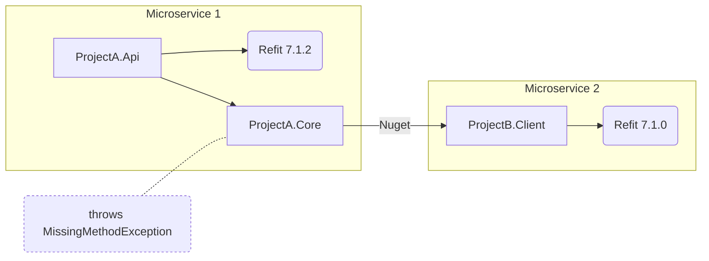

This repo was created to illustrate this Refit issue:
[[Bug]: System.MissingMethodException: Method not found. After upgrading to 7.1.2](https://github.com/reactiveui/refit/issues/1756)


### Problem:
`ProjectA.Api` upgraded Refit from version `7.1.1` to `7.1.2`, then `ProjectA.Core` started throwing the following exception:
```
System.MissingMethodException: Method not found: 
	'Boolean Refit.IApiResponse`1.get_IsSuccessStatusCode()'.
```
This happens because `ProjectA.Core` doesn't have a direct dependency to Refit, so it implicitly uses `7.1.0` while the root project is using `7.1.2`.

More information here: [How NuGet resolves package dependencies](https://learn.microsoft.com/en-us/nuget/concepts/dependency-resolution#direct-dependency-wins)

### Possible solutions:
1. `ProjectB.Client` updates to `7.1.2` (might not be possible if owned by another team)
2. `ProjectA.Core` adds a direct dependency to Refit `7.1.2` 
3. `ProjectA.Api` removes direct dependency to Refit (if not using it)
4. `ProjectA.Api` reverts to `7.1.1`